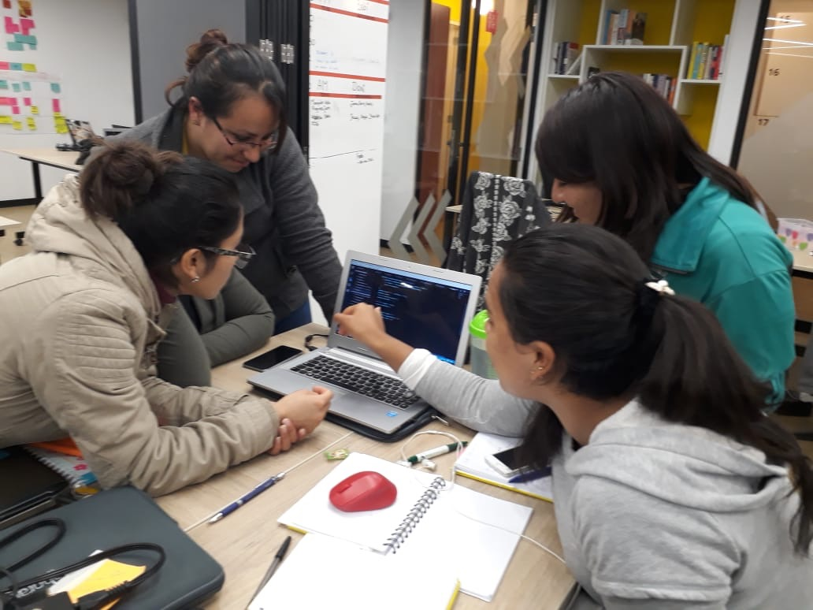
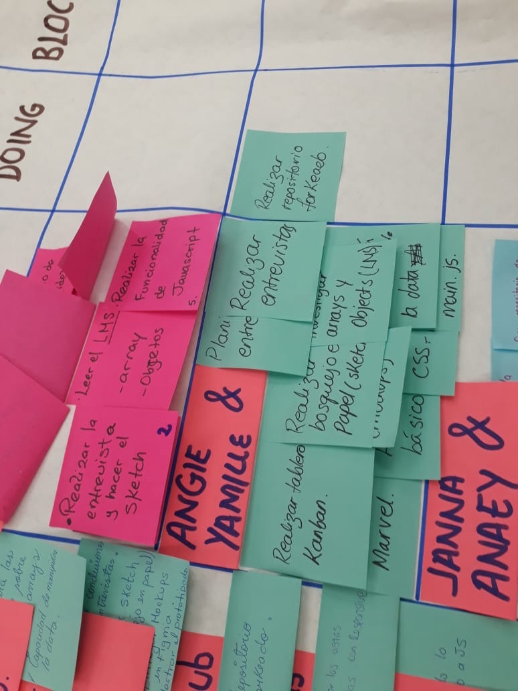
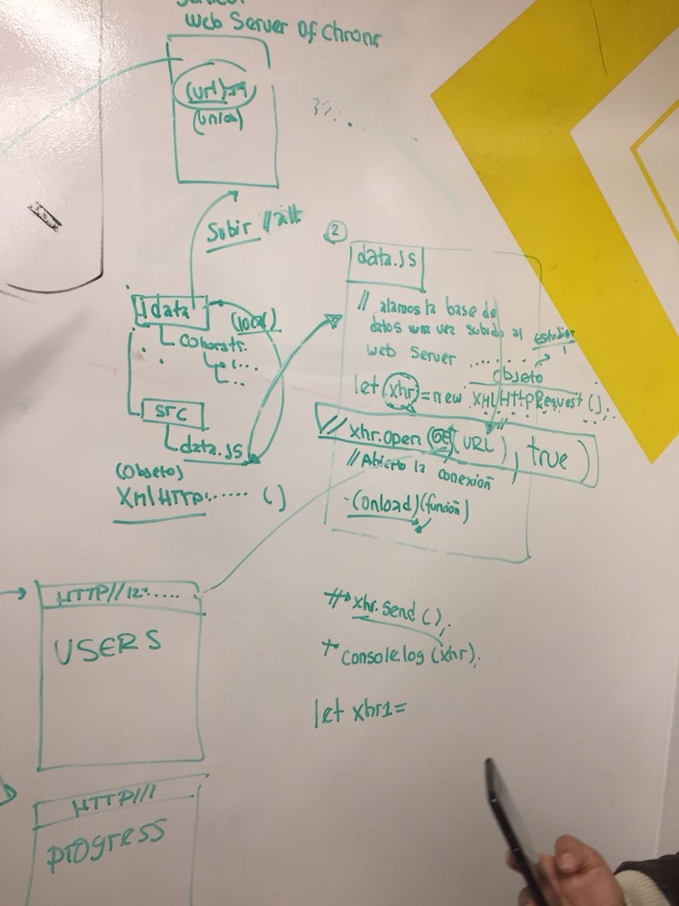
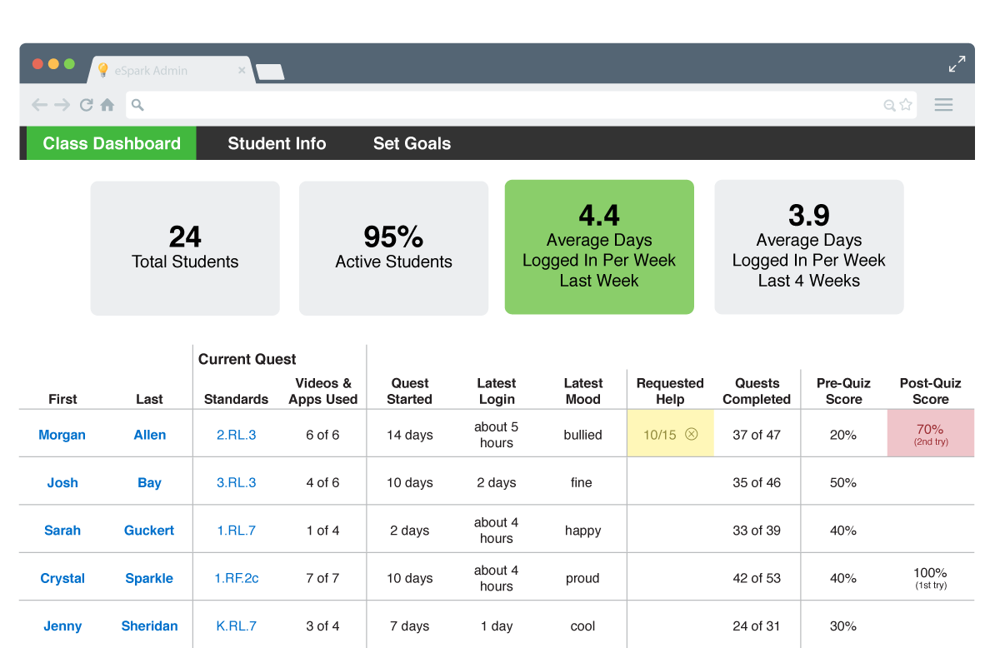
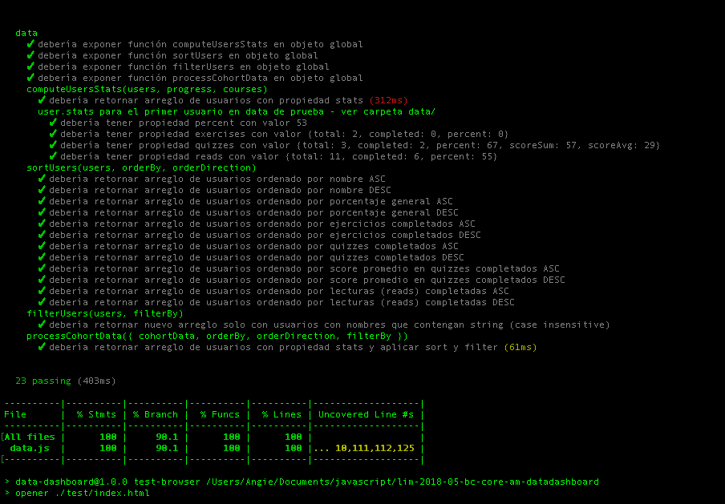

# Data Dashboard

## Colaboradora
+ Angie Cortez

## Preámbulo

En Laboratoria, las Training Managers (TMs) hacen un gran trabajo al analizar la
mayor cantidad de datos posibles respecto al progreso de las estudiantes para
apoyarlas en su aprendizaje.

La principal medida de progreso de una estudiante en Laboratoria es su avance
completando los proyectos de la [Ruta de Aprendizaje](https://docs.google.com/spreadsheets/d/1AoXQjZnZ5MTPwJPNEGDyvn5vksiOUoPr932TjAldTE4/edit#gid=536983970)
y su desempeño en función a la [Rúbrica de Niveles Esperados](https://docs.google.com/spreadsheets/d/e/2PACX-1vSkQy1waRpQ-16sn7VogiDTy-Fz5e7OSZSYUCiHC_bkLAKYewr4L8pWJ_BG210PeULe-TjLScNQQT_x/pubhtml).
Sin embargo, para completar estos proyectos las estudiantes acceden a contenidos
de aprendizaje (lecturas, videos, ejercicios y quizzes) en un sistema que
llamamos LMS (Learning Management System). El LMS acumula data sobre quién
leyó qué, qué ejercicios se han completado, los resultados de los quizzes, etc.

A pesar de que la data de progreso del LMS (ej. lecturas leídas, ejercicios
  completados, nota en quizzes, etc.) no impacta directamente en la evaluación
  de una estudiante, sí es una pieza de información relevante que las TMs
  quisieran visualizar para tener un mejor entendimiento de cómo va cada
  estudiante en su proceso de aprendizaje.

Así, el reto de este proyecto es crear una interfaz donde las TMs puedan
_ver_ y _usar_ la data de progreso del LMS. Para ello, proponemos crear un
**data dashboard** (_tablero de visualización de datos_).

### User Experience Design

#### Spring Planning
 A lo largo de las semanas he ido decidiendo como se veria la interfaz de las alumnas y como la training manager veria el Dashboard de una manera fácil y didactica, planifique los string de acuerdo a lo que podria hacer de manera eficaz. Recibí mucho feedback de parte de mi Squad, para ver la funcionalidad y ver como se veria la Interfaz.

 
 

#### 1) Definición del producto

En el `README.md` cuéntanos cómo pensaste y te acercaste a los usuarios al
desarrollar tu producto (Tip: entrevistas) y cuál fue tu proceso para definir
el producto final a nivel de experiencia y de interfaz. Es importante que
detalles:

* Quiénes son los principales usuarios de producto.
La principal usuaria sera Alejandra, quien es la Training Manager de Laboratoria.

* Cuáles son los objetivos de estos usuarios en relación con el producto.
El objetivo principal del Data-Dashboard es que Alejandra pueda visualizar el avanze de las alumnas con respecto a su porcentaje general, lecturas leída, quizzes completados entre otros.

* Cuáles son los datos más relevantes que quieren ver en la interfaz y
  por qué. Cómo los descubriste.
  Segun la entrevista que se le hizo a Gonzalo, las training manager desean ver el porcentaje general de las alumnas en un grafico, tambien desean buscar a las estudiantes, ordenarlas por orden de completitud, porcentaje general, porcentaje de lecturas completadas, porcentaje de quizzes completados, y asi sucesivamente.

* Cuándo revisan normalmente estos datos los usuarios.
  Segun lo conversado, la Training Manager, visualizaría el Data-Dashboard después de cada proyecto. Para ver que tal estuvieron en los avances.

* Cómo crees que el producto les está resolviendo sus problemas.

  Este Data-Dashboard les ayudara a indentificar que Alumnas estan mas preocupadas en su autoaprendizaje como las que no y que medidas podrian tomar de acuerdo a estos indices.

* Cómo fue tu proceso de diseño.

 Desde un principio sabia como queria que se viese la interfaz, pero en el transcurso de las semanas se fueron dando demasiados cambios, analize la interfaz de acuerdo a el proceso funcional de la data.

 

#### 2) Sketch de la solución (prototipo de baja fidelidad)

Este fue mi Sketch inicial en el cual comenze a darme una idea de como queria que fuese la Interfaz.

#### 3) Diseño de la Interfaz de Usuario (prototipo de alta fidelidad)

Lamentablemente no he podido implementar aún el prototipo de alta fidelidad, pero dejo una imagen de la que me guíe mucho en este proceso.

#### 4) Tests

Adjunto mi test

### Implementación de la Interfaz de Usuario (HTML/CSS/JS)

Luego de diseñar tu interfaz de usuario deberás trabajar en su implementación.
Como mencionamos, **no** es necesario que construyas la interfaz tal como la
diseñaste. Tendrás un tiempo limitado para hackear, así es que deberás priorizar.

Como mínimo, tu implementación debe:

1. Permitir al usuario seleccionar un cohort de una lista de cohorts.
2. Al seleccionar un cohort:
   - Listar las estudiantes de ese cohort
   - Para cada estudiante:
     + Calcular porcentaje de completitud de todos los _cursos_.
     + Calcular grado de completitud de _lecturas_, _ejercicios autocorregidos_,
       y _quizzes_.
   - Ordenar estudiantes por completitud _general_ (porcentaje consumido/completado
     de todos los cursos del cohort en cuestión), de _lecturas_, _ejercicios
     autocorregidos_ y _quizzes_.
   - Filtrar/buscar estudiantes por nombre.
3. Visualizarse sin problemas desde distintos tamaños de pantallas: móviles,
   tablets y desktops.
4. Incluir pruebas unitarias.

Es importante que tu interfaz, a pesar de ser una versión mínima de tu ideal,
igual debe seguir los fundamentos de visual design, como: contraste,
alineación, jerarquía, entre otros.

## Tips / Pistas

Los tips que me brindo Laboratoria me fueron muy utiles, adjunto unos cuantos mas que creo me dieron ejemplos mas detallados y me hicieron entender las los códigos:

*[Array Multidimensional](http://www.jstips.co/es_es/javascript/flattening-multidimensional-arrays-in-javascript/)
*[filtering & Sorting](http://www.jstips.co/es_es/javascript/filtering-and-sorting-a-list-of-strings/)
*[Tania](https://www.taniarascia.com/real-world-examples-of-map-filter-and-reduce-in-javascript/) Me ayudo mucho con las líneas de comando, el uso de array.map, filter y más.
* [Array en MDN](https://developer.mozilla.org/es/docs/Web/JavaScript/Referencia/Objetos_globales/Array)
* [Array.sort en MDN](https://developer.mozilla.org/es/docs/Web/JavaScript/Referencia/Objetos_globales/Array/sort)
* [Array.map en MDN](https://developer.mozilla.org/es/docs/Web/JavaScript/Referencia/Objetos_globales/Array/map)
* [Array.filter en MDN](https://developer.mozilla.org/es/docs/Web/JavaScript/Referencia/Objetos_globales/Array/filter)
* [Array.reduce en MDN](https://developer.mozilla.org/es/docs/Web/JavaScript/Referencia/Objetos_globales/Array/reduce)
* [Array.forEach en MDN](https://developer.mozilla.org/es/docs/Web/JavaScript/Referencia/Objetos_globales/Array/forEach)
* [Object.keys en MDN](https://developer.mozilla.org/es/docs/Web/JavaScript/Referencia/Objetos_globales/Object/keys)
* [Object.entries en MDN](https://developer.mozilla.org/es/docs/Web/JavaScript/Referencia/Objetos_globales/Object/entries)
* [XMLHttpRequest en MDN](https://developer.mozilla.org/en-US/docs/Web/API/XMLHttpRequest)
* [Fetch API en MDN](https://developer.mozilla.org/en-US/docs/Web/API/Fetch_API)
* [json.org](https://json.org/json-es.html)
* [Postman](https://chrome.google.com/webstore/detail/postman/fhbjgbiflinjbdggehcddcbncdddomop?hl=en)
